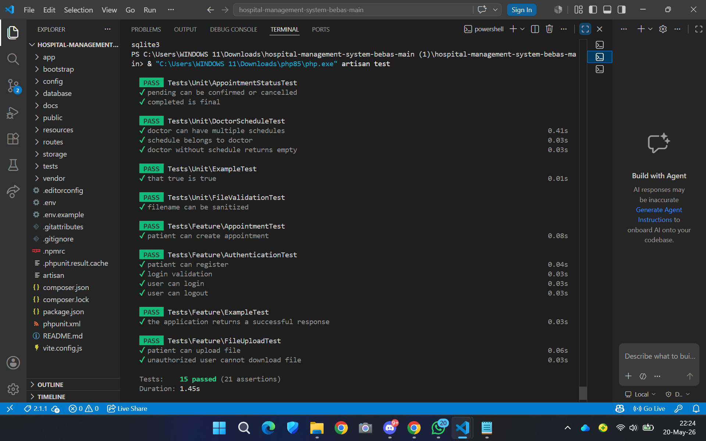

# Hospital Management System — Laravel REST API

> Final Project BNCC LnT Back-End 2026  
> Studi Kasus: Hospital Management System untuk Klinik Sehat Bersama

## 1. Identitas Kelompok

**Nama Kelompok:**  
`BEBAS`

**Anggota Kelompok:**

| No|          Nama                    |    NIM     |         Role / Kontribusi         |
|---|----------------------------------|------------|-----------------------------------|
| 1 | Ni Putu Saraswati                | 2902624635 | Backend API, Database, Testing    |
| 2 | Stella Olivia Setiadi            | 2902652922 | Auth, File Storage, Documentation |
| 3 | Darmaning Maria Anabelle Kristian| 2902634913 | Seeder, Postman, Mail Feature     |

---

## 2. Deskripsi Project

Hospital Management System adalah aplikasi backend berbasis Laravel REST API yang digunakan untuk mengelola proses operasional klinik secara digital.

Sistem ini memiliki tiga jenis pengguna utama:

1. **Admin**
   - Mengelola data pasien, dokter, appointment, laporan, dan file.
   - Memiliki akses penuh terhadap data sistem.

2. **Dokter**
   - Melihat jadwal konsultasi.
   - Mengelola rekam medis pasien.
   - Mengakses appointment yang berkaitan dengan dirinya.

3. **Pasien**
   - Melakukan registrasi dan login.
   - Melihat daftar dokter dan jadwal.
   - Membuat appointment.
   - Melihat appointment dan rekam medis miliknya sendiri.
   - Mengupload dokumen pribadi.

Project ini menerapkan autentikasi menggunakan Laravel Sanctum, role-based authorization, REST API versioning, database relational design, file upload private, seeder, factory, testing, mailing, dan dokumentasi Postman.

---

## 3. Tech Stack

| Teknologi | Keterangan |
|---|---|
| Laravel 13 | Backend framework |
| PHP 8.5 | Bahasa pemrograman |
| Laravel Sanctum | API authentication |
| SQLite / MySQL | Database |
| Eloquent ORM | Relasi database |
| Laravel Storage | File upload dan file management |
| Laravel Mail | Email notification |
| PHPUnit | Automated testing |
| Postman | API testing dan documentation |

---

## 4. Fitur Utama

- Register dan login user.
- Authentication menggunakan Bearer Token Laravel Sanctum.
- Role authorization untuk `admin`, `doctor`, dan `patient`.
- CRUD pasien.
- List dokter beserta jadwal praktik.
- Pembuatan appointment oleh pasien.
- Update status appointment oleh admin/dokter.
- Medical record oleh dokter.
- Upload dan download file medis.
- Export report.
- Seeder dan factory data dummy.
- Pagination pada endpoint listing.
- PHPUnit feature dan unit test.
- Dokumentasi API menggunakan Postman.
- ERD dan struktur database relasional.

---

## 5. Cara Instalasi

Clone repository:

```bash
git clone https://github.com/sarss-arch/hospital-management-system-bebas.git
cd hospital-management-system-bebas

```bash
git clone https://github.com/sarss-arch/hospital-management-system-bebas.git
cd hospital-management-system-bebas
```

Install dependency Laravel:

```bash
composer install
```

Copy file environment:

```bash
copy .env.example .env
```

Generate application key:

```bash
php artisan key:generate
```

Konfigurasi database pada file `.env`:

```env
DB_CONNECTION=mysql
DB_HOST=127.0.0.1
DB_PORT=3306
DB_DATABASE=hospital_management_system
DB_USERNAME=root
DB_PASSWORD=
```

Jalankan migration dan seeder:

```bash
php artisan migrate --seed
```

Jalankan server Laravel:

```bash
php artisan serve
```

Base URL API:

```txt
http://127.0.0.1:8000/api/v1
```

---

## 6. API Documentation

Dokumentasi API tersedia dalam bentuk Postman Collection pada folder:

```txt
docs/HMS.postman_collection.json
```

Postman Environment tersedia pada folder:

```txt
docs/HMS Local.postman_environment.json
```

Seluruh endpoint utama menggunakan prefix:

```txt
/api/v1
```

### Daftar Endpoint Utama

| Method | Endpoint | Deskripsi | Auth |
|---|---|---|---|
| POST | `/api/v1/auth/register` | Registrasi user baru | Public |
| POST | `/api/v1/auth/login` | Login user dan mendapatkan token | Public |
| POST | `/api/v1/auth/logout` | Logout dan invalidate token | Bearer Token |
| GET | `/api/v1/doctors` | Menampilkan daftar dokter dan jadwal | Authenticated |
| GET | `/api/v1/patients` | Menampilkan daftar pasien | Admin |
| GET | `/api/v1/patients/{patient}` | Menampilkan detail pasien | Admin / Owner |
| PUT | `/api/v1/patients/{patient}` | Update data pasien | Admin / Owner |
| POST | `/api/v1/appointments` | Membuat appointment baru | Patient |
| GET | `/api/v1/appointments/{appointment}` | Menampilkan detail appointment | Authorized |
| PUT | `/api/v1/appointments/{appointment}` | Update status appointment | Admin / Doctor |
| DELETE | `/api/v1/appointments/{appointment}` | Membatalkan appointment | Admin / Owner |
| POST | `/api/v1/medical-records` | Membuat rekam medis | Doctor |
| GET | `/api/v1/medical-records/{medicalRecord}` | Menampilkan detail rekam medis | Authorized |
| POST | `/api/v1/files/upload` | Upload dokumen medis | Authenticated |
| GET | `/api/v1/files/{file}` | Download / melihat file | Authorized |
| DELETE | `/api/v1/files/{file}` | Menghapus file | Admin / Owner |
| GET | `/api/v1/reports/export` | Export laporan | Admin |

---

## 7. Database Structure

Project ini menggunakan database relasional dengan tabel utama:

- `users`
- `doctors`
- `patients`
- `schedules`
- `appointments`
- `medical_records`
- `files`
- `notifications`
- `personal_access_tokens`

Relasi database dibuat menggunakan foreign key dan Eloquent ORM. Struktur database mendukung pengelolaan user berdasarkan role, data dokter, pasien, jadwal, appointment, rekam medis, file medis, serta notifikasi.

### Database Backup

File backup database tersedia pada folder:

```txt
database/backup/initial_backup.sql
```

---

## 8. Seeder dan Factory

Project ini menyediakan seeder dan factory untuk menghasilkan data dummy yang digunakan dalam pengujian dan simulasi sistem.

Factory yang tersedia:

- `UserFactory`
- `DoctorFactory`
- `PatientFactory`
- `ScheduleFactory`
- `AppointmentFactory`
- `MedicalRecordFactory`

Seeder digunakan untuk membuat data awal seperti user, dokter, pasien, jadwal, appointment, dan rekam medis.

---

## 9. File Storage

Sistem mendukung fitur upload dan download file medis menggunakan Laravel Storage.

Fitur file storage meliputi:

- Upload dokumen pasien.
- Upload file medis.
- Download file oleh user yang memiliki akses.
- Validasi file.
- Pengamanan akses file berdasarkan role dan ownership.

Endpoint utama:

```txt
POST /api/v1/files/upload
GET /api/v1/files/{file}
DELETE /api/v1/files/{file}
```

---

## 10. Mailing Feature

Sistem mendukung fitur email notification untuk appointment.

Fitur mailing meliputi:

- Email konfirmasi booking appointment.
- Email reminder appointment.
- Email notifikasi perubahan status appointment.

Mailable class digunakan agar struktur email lebih rapi dan mudah dikelola.

---

## 11. Testing

Project ini telah diuji menggunakan PHPUnit.

Command untuk menjalankan test:

```bash
php artisan test
```

Hasil testing terakhir:

```txt
15 tests passed
21 assertions
```

Screenshot hasil testing:



Testing yang tersedia mencakup:

### Unit Test

- `AppointmentStatusTest`
- `DoctorScheduleTest`
- `FileValidationTest`

### Feature Test

- `AuthenticationTest`
- `AppointmentTest`
- `FileUploadTest`

---

## 12. Screenshot Dokumentasi

Screenshot hasil pengujian API dan testing tersedia pada folder:

```txt
docs/screenshoot
```

Daftar screenshot:

- `register.png`
- `login.png`
- `post login.png`
- `get-doctors.png`
- `put appointment.png`
- `appointment 204.png`
- `testing-pass.png`

---

## 13. Cara Menjalankan Postman

1. Buka aplikasi Postman.
2. Klik tombol **Import**.
3. Import file collection:

```txt
docs/HMS.postman_collection.json
```

4. Import file environment:

```txt
docs/HMS Local.postman_environment.json
```

5. Pilih environment **HMS Local**.
6. Jalankan server Laravel:

```bash
php artisan serve
```

7. Gunakan base URL:

```txt
http://127.0.0.1:8000/api/v1
```

---

## 14. Catatan Role dan Authorization

Sistem memiliki tiga role utama:

| Role | Hak Akses |
|---|---|
| Admin | Mengelola data pasien, dokter, appointment, file, dan laporan |
| Doctor | Melihat appointment yang berkaitan, membuat medical record, dan mengelola data medis pasien |
| Patient | Registrasi, login, membuat appointment, melihat data miliknya, dan upload dokumen |

Route sensitif dilindungi menggunakan middleware authentication dan role-based authorization.

---

